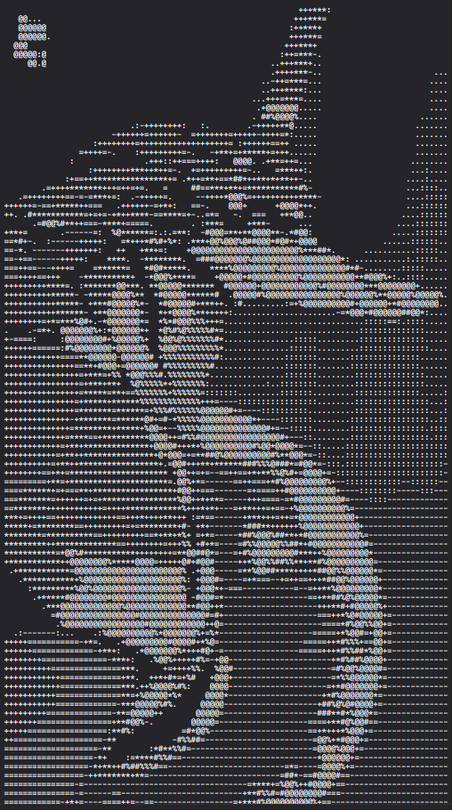

# Jogo de cartas com temática de Neon Genesis Evangelion



## O jogo

### Temática

O jogo consiste em um sistema de batalhas com baralho completo via terminal, baseado no anime popular Neon Genesis Evangelion, onde o jogador enfrenta uma sequência de inimigos usando cartas.

### Personagens

No início da batalha, ele pode escolher entre ser Shinji, Rei ou Asuka (os 3 pilotos de EVA dentro do universo de Evangelion). A cada turno o héroi recupera sua sincronização (energia) e tem seu campo AT (escudo) zerado.

### Compra e Uso de Cartas

Então, ele compra 4 cartas de uma baralho de compras para formar sua mão e escolhe dentre as cartas em sua mão usar:
- uma arma (carta de dano)
- uma carta que recupera seu campo AT (carta de escudo)
- uma carta que aplica um efeito ao inimigo (carta de efeito). 

Cada carta possui seu próprio custo de sincronização (energia), e o jogador pode usar cartas enquanto tiver energia disponível. Caso sua energia acabe, o turno é passado automaticamente.

Após as cartas serem utilizadas estas vão para uma pilha de descarte, e ao fim do turno as cartas não utilizadas tem o mesmo destino.

Caso a pilha de compra acabe, a pilha de descarte é embaralhada e se torna a nova pilha de compra, embora isso não seja mostrado para o jogador.

Para dar dinamicidade ao jogo, tanto o dano das armas quanto o escudo contém um valor base e um incremento aleatório.

### Inimigos

O inimigo do jogador é um anjo, filho de Lilith, que anuncia sua ação no começo de cada turno e a realiza ao fim de cada turno. Ele também possui seu próprio campo AT. 

As ações do inimigo (e seus respectivos valores) também são aleatórias para dar dinamicidade ao jogo.

### Efeitos

O jogador pode usar cartas que concedem um efeito a ele ou ao inimigo, assim como o inimigo pode usar efeitos no jogador ou nele mesmo.

Os efeitos possíveis no jogo são:
- Dano psicológico (veneno): inflinge uma quantidade determinada de dano em quem tem o efeito, durante um certo número de turnos. 
- Regeneração de vida: restaura uma quantidade fixa de vida ao detentor do efeito no início de seu turno.
- Corrosão de campo AT: anula a proteção do campo AT (escudo), fazendo com que todo dano recebido seja aplicado diretamente à vida da entidade.
- Alta taxa de sincronização: aumenta em 50% o dano causado pelos ataques das entidades (excluindo efeitos).
- Baixa taxa de sincronização: reduz em 25% o dano causado pelos ataques das entidades (excluindo efeitos).

A duração dos efeitos é cumulativa (isto é, se uma entidade aplica um mesmo efeito mais de uma vez na outra, o número de turnos que esse efeito durará na entidade que sofre o efeito será somado). Para o caso de uma entidade receber este efeito em diferentes intesidades, a maior intensidade prevalece e o efeito continua ativo pela maior duração entre os dois efeitos.

### Fim do jogo

O combate continua até a morte de uma das entidades. Vence quem eliminar o outro primeiro. Caso ambos morram, o jogo ainda considera que você perdeu.

## Estrutura do projeto

O projeto Java foi criado com a build tool gradle, além de ser usado o JUnit para realização de testes unitários. Assim, a estrutura de pastas consiste em:

- `app/src/main/java`: pasta com as classes .java do projeto, incluindo o App
- `app/src/main/test`: pasta com os arquivos de teste do JUnit
- `app/build`: pasta com os arquivos compilados e outros arquivos gerados
- `gradle`: contém arquivos específicos de versionamento do gradle

### Sobre os arquivos:

- `App`: classe responsável pelas chamadas de metódos do GameManager responsável pelo fluxo do jogo
- `GameManager`:  classe que contém os atributos estáticos do jogo e responsável por toda instanciação das classes, impressão dos menus, seleção de ações, delay entre a execução de ações e novos turnos, lógica de seleção de cartas e combate.
- `Interface`: classe responsável pela parte visual do projeto no terminal, com formatações relativas a cor, menus e assets
- `CardStack`: classe que herda as propriedades de um Stack e acrescenta um método de embaralhamento
- `PlayerHand`: classe que representa a mão do jogador, contendo suas cartas e apresentando métodos para interagir com as pilhas de compra e de descarte
- `Entity`: classe abstrata que contém os atributos encapsulados presentes nas classes filhas
- `Hero`: subclasse de Entity que possui método específico de resetar escudo
- `Enemy`: subclasse de Entity que possui métodos para interagir com o herói.
- `EnemyActions`: enum que define as ações possíveis do inimigo (atacar, ganhar escudo ou usar efeito).
- `Card`: classe abstrata que contém os atributos encapsulados, e o método abstrato para usá-la, presente nas classes filhas 
- `ShieldCard`: subclasse de Card que permite recuperar o campo AT (escudo) do jogador
- `DamageCard`: subclasse de Card que permite dar dano ao inimigo
- `EffectCard`: subclasse de Card que permite usar um efeito definido
- `Effect`: classe abstrata que permite a implementação de efeitos pelas classes filhas
- `PsichicEffect`: subclasse de Effect que implementa o efeito de dano psicológico (veneno).
- `HealthRegeneration`: subclasse de Effect que implementa a regeneração de vida por turno.
- `ATFieldCorrosion`: subclasse de Effect que implementa a corrosão do campo AT, ignorando o escudo ao receber dano.
- `HighSyncRate`: subclasse de Effect que implementa o aumento de dano por sincronização.
- `LowSyncRate`: subclasse de Effect que implementa a redução de dano por sincronização.
- `EventEnum`: enum que define os tipos de evento para serem percebidos pelos efeitos
- `ColorEnum`: enum que define as diferentes cores possíveis da interface

## Execução de testes unitários (em linux)

Para executar os testes unitários implementados, basta executar:
```
./gradlew test
```

Já para certificar-se que pelo menos 40% do código foi coberto pelos testes, execute:
```
./gradlew check
```
O build foi configurado para que, caso a cobertura esteja abaixo de 40%, ele falhe. Assim, se o código rodar sem problemas, então a cobertura foi atingida.

## Compilação e execução do projeto (em linux)

Certifique-se que você está na pasta raiz do projeto no prompt de comandos.

Inicialmente, execute o comando abaixo para dar permissão de execução ao gradlew:
```
chmod +x gradlew
```

Para compilar o projeto, basta executar o código abaixo:
```
./gradlew build -x test
```

Já para executar, use o comando:
```
./gradlew run
```

## Contribuição de IA Generativa

A documentação dos arquivos Java do projeto usando Javadoc e as descrições dos efeitos presentes neste README foram elaboradas com o auxílio de inteligências artificiais generativas, como Gemini (by Google DeepMind) e Cursor AI (by Anysphere, Inc). Tais LLMs também auxiliaram na utilização das bibliotecas `Files`, `Path` e `Paths` para a impressão de arquivos `.txt`. Além disso, elas também foram empregadas na elaboração de parte dos testes unitários usando JUnit. Por fim, elas foram usadas para auxiliar no desenvolvimento de técnicas para salvar dados em arquivos json usando a biblioteca Jackson.